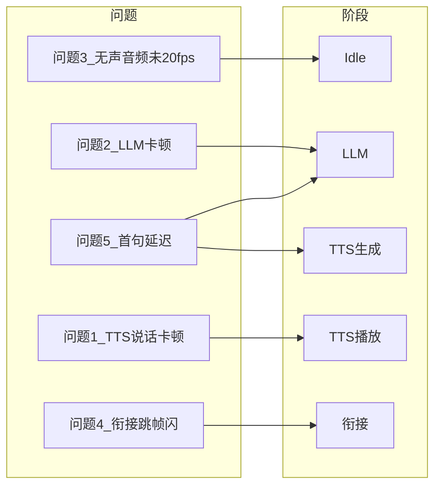
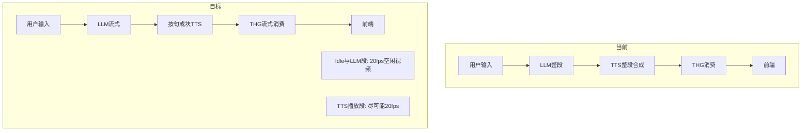

# 面试环节流畅度与 LLM-TTS 流式 — 需求与实现规格

**读者**：执行实现的 Agent / 开发者  
**目标**：文档即规格；读完即可按「问题 → 阶段 → 根因 → 方案 → 验收」逐条实现，减少反复沟通。

---

## 0. 元信息与术语

### 阶段定义（全文统一用语）

| 阶段 | 定义 |
|------|------|
| **Idle** | 无 LLM、无 TTS 在工作。包含：用户仅在打字、仅录音未触发 ASR/LLM、连接后未发首条消息、说完一句话后等待下一轮。 |
| **LLM** | 用户已提交文本或 ASR 结束，LLM 正在推理，尚未把文本交给 TTS。 |
| **TTS 生成** | TTS 正在将 LLM 返回的文本合成为音频；THG 可能尚未或正在消费该音频。 |
| **TTS 播放** | 前端正在播放 TTS 音频，THG 用 TTS 音频驱动口型并推送视频帧。 |
| **衔接** | 任意两段之间的切换：Idle→LLM、LLM→TTS 生成、TTS 播放→Idle 等。 |

### 目标帧率

- 全文统一为 **20fps**（与前端 `TARGET_FPS`、50ms 帧间隔一致）。
- 若某阶段因模型限制无法稳定 20fps，则采用文档内约定的最低 fps 作为验收下限。

### 阶段与问题映射

| 问题 | Idle | LLM | TTS 生成 | TTS 播放 | 衔接 |
|------|------|-----|----------|----------|------|
| 问题1 TTS 说话卡顿 | | | | 是 | |
| 问题2 LLM 阶段卡顿 | | 是 | | | |
| 问题3 无声音频未 20fps | 是 | | | | |
| 问题4 衔接跳帧/闪 | | | | | 是 |
| 问题5 首句延迟 | | 是 | 是 | | |

### 当前 vs 目标数据流

### 关键代码锚点（供 Agent 精确定位）

| 用途 | 文件路径 | 符号/位置 |
|------|----------|-----------|
| 后端流程入口 | [backend/app/api/websocket.py](backend/app/api/websocket.py) | `process_from_text` |
| 空闲视频启动/停止 | [backend/app/api/websocket.py](backend/app/api/websocket.py) | `start_idle_video_generation`、`stop_idle_video_generation` |
| 空闲视频生成 | [backend/app/services/thg_service.py](backend/app/services/thg_service.py) | `generate_idle_video`（默认参数 `fps`） |
| 空闲推理配置与静音分支 | [backend/app/services/dihuman_core.py](backend/app/services/dihuman_core.py) | `IDLE_INFERENCE_FPS`、静音分支中 `idle_frame_interval` |
| TTS+THG 管道 | [backend/app/api/websocket.py](backend/app/api/websocket.py) | `tts_collect_task`、`audio_stream_for_thg`、`thg_task` |
| 数字人出图逻辑 | [backend/app/services/dihuman_core.py](backend/app/services/dihuman_core.py) | `process()`、`AUDIO_PROCESS_THRESHOLD`、`using_feat.shape[0]>=8` |
| 前端播放与队列 | [frontend/src/App.tsx](frontend/src/App.tsx) | `handleVideoChunk`、`videoFrameQueueRef`、`startPlaybackLoop`、`stopPlaybackOnly`、`resetPlaybackState` |
| 流式 LLM 能力 | [backend/app/services/orchestrator.py](backend/app/services/orchestrator.py) | `process_text_stream_pipeline` |
| 流式 LLM 实现 | [backend/app/services/llm_qwen.py](backend/app/services/llm_qwen.py)、[backend/app/services/llm_bailian.py](backend/app/services/llm_bailian.py) | `optimize_text_stream` |

---

## 1. 问题一：TTS 说话阶段卡顿、达不到 20fps

**问题描述**  
数字人用 TTS 音频做口型推理并渲染时，前端观感卡顿，明显不足 20fps。

**所在阶段**  
TTS 播放。

**根因说明**

- [backend/app/services/dihuman_core.py](backend/app/services/dihuman_core.py)：出图由「攒够 7200 样本（`AUDIO_PROCESS_THRESHOLD`）才开始处理」以及「每次消费 800 样本」和「`using_feat.shape[0]>=8` 才跑 UNet 出一帧」共同决定，实际出图速率远低于每 50ms 一帧，无法稳定 20fps。
- [backend/app/api/websocket.py](backend/app/api/websocket.py) 中 `thg_task` 在每发一帧视频后执行 `await asyncio.sleep(0.01)`，进一步限制上行帧率。

**解决方向**

- 在保证口型可用的前提下，降低出图门限或允许「不足 8 帧特征时 padding 出图」，使 [dihuman_core.py](backend/app/services/dihuman_core.py) 在 TTS 段内尽量接近约 50ms 一帧。
- 评估减小或去掉 [websocket.py](backend/app/api/websocket.py) 中 `thg_task` 内每帧后的 `asyncio.sleep(0.01)`。
- 若核心无法在说话段稳定 20fps，则采用折中验收：**TTS 播放段实测帧率不低于 15fps**，且观感较当前明显流畅。

**验收标准**

- 在 TTS 播放阶段，前端持续收到视频帧且观感流畅。
- 实测帧率：尽量接近 20fps；若受模型限制，则不低于 15fps（以 1 秒内收到的 `video_chunk` 数或前端等效计数为准）。

**建议修改的文件与符号**

- [backend/app/services/dihuman_core.py](backend/app/services/dihuman_core.py)：`AUDIO_PROCESS_THRESHOLD`、`process()` 中「`using_feat.shape[0]>=8`」及 800 样本消费处。
- [backend/app/api/websocket.py](backend/app/api/websocket.py)：`thg_task` 内每帧发送后的 `await asyncio.sleep(0.01)`。

---

## 2. 问题二：LLM 阶段卡顿

**问题描述**  
LLM 推理过程中（尚未到 TTS），画面由空闲视频（无声音频推理）驱动，但渲染帧率不足，出现卡顿。

**所在阶段**  
LLM。

**根因说明**

- 空闲视频整条链路被固定为 15fps：
  - [backend/app/api/websocket.py](backend/app/api/websocket.py)：`generate_idle_video(..., fps=15)`。
  - [backend/app/services/thg_service.py](backend/app/services/thg_service.py)：`generate_idle_video` 默认参数 `fps=15`，且用 `frame_interval = 1.0 / fps` 做 `await asyncio.sleep(frame_interval)`。
  - [backend/app/services/dihuman_core.py](backend/app/services/dihuman_core.py)：`IDLE_INFERENCE_FPS = 15`，静音分支中 `idle_frame_interval = max(1, int(20 / IDLE_INFERENCE_FPS))` 与 15fps 一致。

**解决方向**

- 将空闲视频在全链路统一为 20fps：
  - [websocket.py](backend/app/api/websocket.py)：调用 `generate_idle_video(..., fps=20)`。
  - [thg_service.py](backend/app/services/thg_service.py)：`generate_idle_video` 默认参数改为 `fps=20`。
  - [dihuman_core.py](backend/app/services/dihuman_core.py)：`IDLE_INFERENCE_FPS = 20`，并保证空闲分支内 `idle_frame_interval` 与 20fps 一致（当 `IDLE_INFERENCE_FPS=20` 时，`int(20/20)=1`，即每帧都出图，由外层 20fps 的 sleep 控速即可）。

**验收标准**

- 在 LLM 推理期间，前端显示的空闲视频稳定在 20fps，无肉眼可见卡顿。

**建议修改的文件与符号**

- [backend/app/api/websocket.py](backend/app/api/websocket.py)：`start_idle_video_generation` 内对 `generate_idle_video` 的调用，传入 `fps=20`。
- [backend/app/services/thg_service.py](backend/app/services/thg_service.py)：`generate_idle_video` 的默认参数 `fps: int = 20`。
- [backend/app/services/dihuman_core.py](backend/app/services/dihuman_core.py)：常量 `IDLE_INFERENCE_FPS = 20`。

---

## 3. 问题三：无声音频推理达不到 20fps

**问题描述**  
在 LLM 和 TTS 都未工作时（用户仅打字、仅说话、或什么都不做），应用应使用无声音频做推理并保持 20fps，但当前达不到。

**所在阶段**  
Idle。

**根因说明**

- 与问题二相同：整条空闲视频链路为 15fps。
- 此外：WebSocket 连接建立后、或部分时段（例如用户仅打字、仅录音尚未触发 ASR）未启动空闲视频，导致某段时间完全没有新帧，出现长时间静态画面。

**解决方向**

- 同问题二：将空闲视频在全链路统一为 20fps。
- 在 WebSocket 连接建立后（[websocket.py](backend/app/api/websocket.py) 中 `await websocket.accept()` 之后）、且当前无其它处理任务时，**自动启动空闲视频**（调用 `start_idle_video_generation()`）；在开始 LLM/TTS/THG 前再调用 `stop_idle_video_generation()`。
- 确保「仅打字 / 仅录音 / 连接后无操作」时也有持续 20fps 的无声音频推理，无长时间静态画面。

**验收标准**

- 在任意「无 LLM、无 TTS」时段，前端视频均以约 20fps 更新。
- 连接后不发送任何消息、或仅输入框打字、或仅录音不结束，画面均应持续更新，无长时间静态画面（除非产品逻辑明确要求暂停）。

**建议修改的文件与符号**

- 与问题二相同的三处（websocket 调用 fps、thg_service 默认 fps、dihuman_core `IDLE_INFERENCE_FPS`）。
- [backend/app/api/websocket.py](backend/app/api/websocket.py)：`websocket_endpoint` 中连接建立后、主循环 `while True` 之前或首轮可触发时机，在「无 processing_task 或未在处理」的条件下调用 `start_idle_video_generation()`；并在 `process_from_text` 开头、以及任何会启动 LLM/TTS/THG 的入口前确保已调用 `stop_idle_video_generation()`（若当前在跑空闲视频）。

---

## 4. 问题四：环节衔接跳帧/闪

**问题描述**  
阶段切换时（如 LLM 结束进入 TTS、TTS 播完回到用户说话）前端视频出现明显跳帧或闪烁。

**所在阶段**  
衔接（Idle↔LLM↔TTS 生成↔TTS 播放）。

**根因说明**

- Idle 与 THG 的 `frame_index`/时间戳不连续：idle 任务从 0 递增，THG 任务也从 0 递增，两段之间 index 或 timestamp 断裂。
- 切换瞬间存在「无新帧」的间隙：例如 `stop_idle_video_generation()` 后、THG 第一帧产出前，前端没有新帧；或 TTS 播完、`start_idle_video_generation()` 尚未产出首帧时，出现断档。
- [backend/app/services/dihuman_core.py](backend/app/services/dihuman_core.py) 的 DiHumanProcessor 在静音/非静音切换时有状态延迟（如 `empty_audio_counter` 需达到 100 才设 `silence=True`），可能导致衔接处几帧状态不一致。
- 前端在 [App.tsx](frontend/src/App.tsx) 的 `stopPlaybackOnly` 等时机清空 `videoFrameQueueRef`、`nextVideoFrameIndexRef`，但保留 `lastVideoFrameRef`；若下一段帧的 index 从 0 开始，可能触发异常重绘或同步逻辑跳变，产生闪烁。

**解决方向**

- 后端：维护跨 idle 与 THG 的**全局递增 `frame_index`**（或统一时间基准），在 [websocket.py](backend/app/api/websocket.py) 或连接级状态中保存，idle 与 `thg_task` 产出帧时均使用该全局计数并递增，避免每段从 0 重新开始。
- 在「无新帧」的间隙：前端保持上一帧显示，不清空 `lastVideoFrameRef`/画布；后端尽可能缩短断档（例如 TTS 段在 stop_idle 后立即启动 THG，或 THG 结束后立即 start_idle）。
- 在 stop_idle → THG、THG 结束 → start_idle 时，对 DiHumanProcessor 做**明确 reset（或 soft_reset）**，使静音/非静音切换干净，避免衔接处状态延迟导致的画面异常。
- 前端：在衔接处不因 `frame_index` 或 `timestamp_ms` 突变导致清空画面或触发不必要的重绘；保持「上一帧保留直至新流首帧到达」的行为。
- 可选：边界 1～2 帧做淡入或「保持上一帧再替换」，降低人眼对切换的敏感度。

**验收标准**

- 阶段切换时无明显跳帧或闪烁，画面连续过渡。
- 多轮对话（用户说 → LLM → TTS 播放 → 用户再说）反复进行，每次衔接处无可见跳变。

**建议修改的文件与符号**

- [backend/app/api/websocket.py](backend/app/api/websocket.py)：在连接级维护全局 `frame_index`（或等价时间戳）；在 `idle_video_loop` 和 `thg_task` 中发送 `video_chunk` 时使用并递增该全局 index；在 stop_idle 后、启动 thg_task 前对 `orchestrator.thg_service` 的 processor 调用 reset（若暴露）或通过现有 reset 接口统一；THG 结束后、start_idle 前同样考虑 reset。
- [backend/app/services/thg_service.py](backend/app/services/thg_service.py)：若需要在衔接时重置，确保 `reset()` 或 DiHumanProcessor 的 `reset(soft_reset=...)` 在合适时机被调用。
- [frontend/src/App.tsx](frontend/src/App.tsx)：`handleVideoChunk`、`stopPlaybackOnly`、`resetPlaybackState`；确保衔接时不清空当前显示的 lastFrame，仅更新队列与同步状态。

---

## 5. 问题五：LLM 与 TTS 非流式导致首句延迟

**问题描述**  
用户说完后必须等待 LLM 整段推理完成才能把文本交给 TTS，导致要等较久才能听到第一句话。

**所在阶段**  
用户输入结束 → 首句 TTS 播放之间（跨 LLM 与 TTS 生成）。

**根因说明**

- [backend/app/api/websocket.py](backend/app/api/websocket.py) 使用 `process_from_text`，内部为：
  - `optimized_text = await orchestrator.llm_service.optimize_text(text)`（整段返回）；
  - 然后才调用 `orchestrator.tts_service.synthesize(optimized_text)`。
- 未使用已有的 [orchestrator.py](backend/app/services/orchestrator.py) 中 `process_text_stream_pipeline`，以及 [llm_qwen.py](backend/app/services/llm_qwen.py) / [llm_bailian.py](backend/app/services/llm_bailian.py) 中的 `optimize_text_stream`。

**解决方向**

- 改为流式链路：使用 `optimize_text_stream`（或按句/按块切分）驱动管道；每得到一句或一块可用文本即送入 TTS 合成，并接入现有 TTS→THG→前端的流（保持「第一帧视频后再开始往前端发 TTS 音频」等逻辑一致）。
- 在 [websocket.py](backend/app/api/websocket.py) 中接入「流式文本 → 按句/块 TTS → 同一 THG/前端播放」的流程；可参考或复用 [orchestrator.py](backend/app/services/orchestrator.py) 中 `process_text_stream_pipeline` 的设计（若其满足「按句/块 TTS + 与 THG 对接」），或在 websocket 内实现等价逻辑。
- 保证打断、结束面试等状态不受影响：流式管道中仍需响应 `interrupt`、`end_interview`，并正确停止 LLM 流、TTS、THG 与空闲视频的启停。

**验收标准**

- 用户结束输入后，在 LLM 未完全生成整段回复的情况下，首句 TTS 即可开始播放。
- 首句延迟较当前明显缩短；可量化为：**首句 TTS 开始播放不晚于用户结束输入（或 ASR 结果到达）后 3 秒**（在正常网络与负载下）；若可实现更短，则以更短为目标。

**建议修改的文件与符号**

- [backend/app/api/websocket.py](backend/app/api/websocket.py)：新增或切换为「流式处理路径」：使用 `orchestrator.llm_service.optimize_text_stream(text)`（或等价），按句/块迭代，每块调用 `orchestrator.tts_service.synthesize(子文本)` 并 feed 到统一的 TTS 缓冲区/队列，供 `audio_send_task` 与 `audio_stream_for_thg` 消费；保留或适配 `thg_task`、`audio_send_task`、`tts_collect_task` 的协作方式。
- [backend/app/services/orchestrator.py](backend/app/services/orchestrator.py)：若采用复用，则确保 `process_text_stream_pipeline` 与 websocket 的 `send_message`、面试状态、打断/结束逻辑兼容；否则在 websocket 内实现流式管道并调用 orchestrator 的 llm/tts/thg 单点能力。

---

## 6. 实现顺序与依赖建议

建议实现顺序：**2 → 3 → 1 → 4 → 5**。

- 先做 **问题2、问题3**：统一空闲 20fps 与全时段空闲覆盖，改动集中、易验证。
- 再做 **问题1**：优化 TTS 段帧率，可能涉及 dihuman_core 参数，需兼顾口型质量。
- 然后 **问题4**：衔接跳帧/闪，依赖前后段都在产帧，且需要全局 frame_index 或时间基准。
- 最后 **问题5**：流式 LLM→TTS，改动管道逻辑与状态机，影响面最大，放在最后便于前面四项稳定后再接入。

每个问题对应的「建议修改的文件与符号」已写在各自小节末尾；汇总见上文「关键代码锚点」表。

---

## 7. 验收与自测要点

### 问题1（TTS 说话阶段卡顿）

1. 提交一段文字或说完一句话触发 LLM+TTS，在 TTS 播放期间观察前端「已接收 X 个视频帧」或等价计数，计 5 秒内收到的帧数，应 ≥75（约 15fps）或 ≥100（约 20fps）。
2. 肉眼观察数字人口型与画面是否连贯，无明显顿挫。

### 问题2（LLM 阶段卡顿）

1. 提交文字或说话触发 LLM，在「开始文本处理」到「开始语音合成」之间观察画面，计 3 秒内收到的 video_chunk 数，应 ≥60（20fps）。
2. 肉眼观察该段时间内画面是否稳定 20fps 更新。

### 问题3（无声音频推理 20fps）

1. 连接成功后不发送任何消息，观察画面是否持续更新，计 5 秒内帧数，应 ≥100。
2. 仅输入框打字、不提交，或仅录音不结束，画面应持续更新且约 20fps。

### 问题4（衔接跳帧/闪）

1. 连续进行多轮：用户说 → 等待回复播放完 → 再说，重复 3～5 次，每次过渡时观察是否有跳帧或闪烁。
2. 特别观察「LLM 结束 → 第一句 TTS 出现」以及「TTS 播完 → 回到空闲」两个时刻是否平滑。

### 问题5（首句延迟）

1. 用户提交一句话或说完一句话，用秒表测量：从「用户操作完成」到「听到第一句 TTS 声音」的时间，应 ≤3 秒（目标更短则记录实际值）。
2. 对比改造前同场景下的首句延迟，确认明显缩短。

### 最小可接受帧率（折中约定）

- **Idle / LLM 段**：必须达到 **20fps**（由空闲视频链路保证）。
- **TTS 播放段**：若因模型结构无法稳定 20fps，则 **不低于 15fps** 且观感明显优于当前即可。
